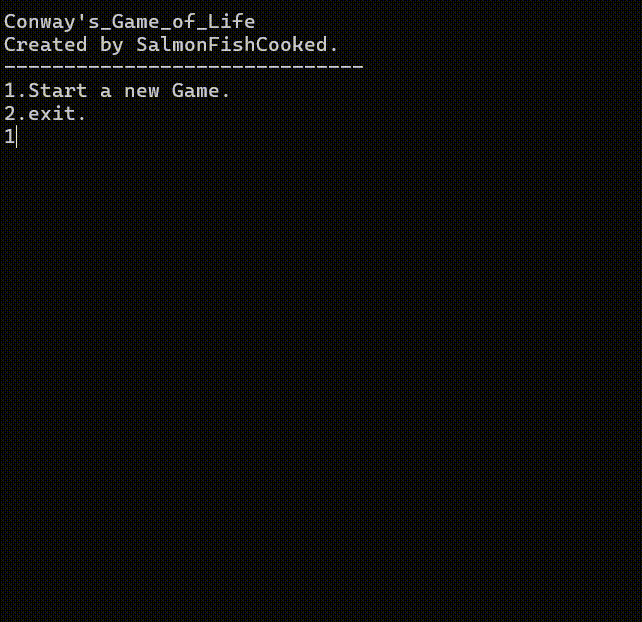

# Conway's Game of Life

## 👾 Gameplay

The appearance of this game is as follows:

## ☁️ How to run this game

> I'm sorry for that this is an old project, so it only supports on Windows. (So compile it on Windows platform)
> Because I used <Windows.h>, you can change it to corresponding library on different platforms, so that you can compile it on different platforms!

If you don't want to compile the source code, directly run `Conway's Game of Life.exe`.

1. cd to Conway's-Game-of-Life/src
2. use  `g++ -o game main.cpp Cell.cpp GameInstance.cpp`
3. run  `./game.exe`

HAVE FUN! :)
